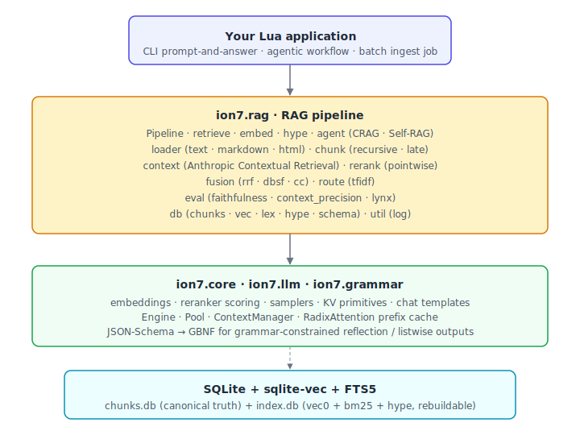

<div align="center">

# ion7-rag

**Local-first Retrieval-Augmented Generation as a pure-Lua library, on top of [ion7-core](https://github.com/Ion7-Labs/ion7-core), [ion7-llm](https://github.com/Ion7-Labs/ion7-llm) and [ion7-grammar](https://github.com/Ion7-Labs/ion7-grammar).**

[](LICENSE)
[](https://luajit.org/)
[](#status)



</div>

---

`ion7-core` provides embeddings, rerankers and generation. `ion7-llm` provides
the chat pipeline, multi-session pool and prefix cache. `ion7-grammar`
provides constrained output. `ion7-rag` wires those into a working RAG
system : ingestion, chunking, contextual retrieval, hybrid search, fusion,
reranking, agentic loops, evaluation.

## Status

**v0.1.0-alpha1.** API surface is unstable until the first non-alpha
release. Every public module ships with LuaDoc and a unit test ; suites
that need real GGUF models or `lsqlite3` skip cleanly when the environment
lacks them.

## Design at a glance

- **Storage substrate.** Two SQLite files. `chunks.db` holds the canonical
  text, document metadata, provenance and citations — the source of truth.
  `index.db` holds a `sqlite-vec` dense vector store (binary 192-d
  shortlist + fp32 1024-d rerank tier), an FTS5 BM25 index, and a HyPE
  hypothetical-question vector tier — all rebuildable from `chunks.db`.
- **Hybrid retrieval.** RRF (default), DBSF, Convex Combination as fusion
  options over (dense + lexical + hype) candidate lists. 4:1 dense:BM25
  prior from Anthropic's Contextual Retrieval results.
- **Contextual Retrieval.** A small contextualizer model rewrites each
  chunk with 50–100 tokens of document-level context before embedding and
  FTS indexing. ion7-llm's RadixAttention prefix cache amortises the
  per-document cost.
- **Late chunking.** Optional Günther-style late chunker (arXiv:2409.04701)
  produces context-aware chunk vectors from a single full-document
  embedder pass — no LLM call.
- **Generation-time loops.** CRAG (corrective : evaluate → reformulate →
  retry) and Self-RAG (reflective : decide-to-retrieve, per-hit relevance,
  post-answer support) wrap the Pipeline. Self-RAG's reflection tokens
  are constrained to JSON via `ion7-grammar`, so any chat-tuned model
  emits valid output by construction.
- **Evaluation.** RAGAs-style Faithfulness, ContextPrecision, and a Lynx
  hallucination judge. All reference-free.
- **Library, not a server.** No HTTP, no SSE, no CLI binary, no daemon.
  ion7-rag is meant to be embedded.

## Quick taste

```lua
local ion7 = require "ion7.core"
local rag  = require "ion7.rag"

ion7.init({ log_level = 0 })

local model = ion7.Model.load(os.getenv("ION7_EMBED_MODEL"))
local pipe  = rag.Pipeline.new({
    model      = model,
    chunks_db  = "./data/chunks.db",
    index_db   = "./data/index.db",
    contextual = true,         -- Anthropic Contextual Retrieval
    fusion     = "rrf",        -- or "dbsf", "cc"
})

pipe:ingest({ "./docs/handbook.md", "./docs/policies/" })

local response = pipe:ask("How do reservations work past the cutoff?")
print(response.content)

ion7.shutdown()
```

## Documentation

- [`ARCHITECTURE.md`](ARCHITECTURE.md) — layered design, two-DB schema,
  retrieval flow, runtime cooperation with the rest of the ion7 stack.
- [`INSTALL.md`](INSTALL.md) — install paths, sibling-checkout layouts,
  troubleshooting.

## Compatibility

| Component     | Requirement                                          |
|---------------|------------------------------------------------------|
| LuaJIT        | 2.1 (any post-2017 build)                            |
| ion7-core     | matched release ; embedder + reranker bridge needed  |
| ion7-llm      | matched release                                      |
| ion7-grammar  | matched release ; only required by constrained paths |
| `lsqlite3`    | 0.9.5+ with `sqlite-vec` extension loadable          |
| `lpeg`        | 1.0+                                                 |
| OS            | whatever ion7-core builds on (Linux glibc, macOS 12+) |

## License

[MIT](LICENSE). ion7-rag builds on
[ion7-core](https://github.com/Ion7-Labs/ion7-core),
[ion7-llm](https://github.com/Ion7-Labs/ion7-llm) and
[ion7-grammar](https://github.com/Ion7-Labs/ion7-grammar) — themselves built
on [llama.cpp](https://github.com/ggml-org/llama.cpp) by Georgi Gerganov and
contributors.
